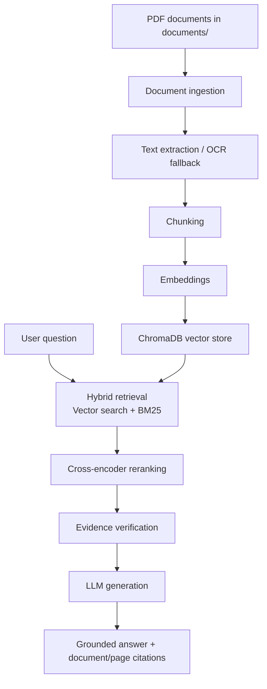

# Ask From Document — Domain-Specific RAG for Baroque Art

Ask From Document is a domain-specific Retrieval-Augmented Generation system for asking questions about a curated collection of Baroque art documents. The application retrieves relevant passages from the indexed corpus, grounds the answer in those sources, and returns document/page citations to make the response traceable.

## What This Project Demonstrates

- End-to-end RAG pipeline design for a bounded domain corpus
- Hybrid retrieval using semantic vector search and BM25 keyword matching
- Cross-encoder re-ranking of retrieved evidence
- Evidence-grounded answer generation constrained by retrieved context
- Citation-aware responses tied to document and page metadata
- Automated evaluation with a golden dataset and GitHub Actions

## Demo

### Live Demo
[Live demo URL or "Run locally"]

### Screen Recording
[Watch the 1–2 minute screen-recorded demo](ADD_VIDEO_LINK_HERE)

### Screenshots

The project currently does not include checked-in screenshots. Add files under `docs/screenshots/` and replace the placeholders below.

- [Application UI screenshot placeholder — add to `docs/screenshots/app-ui.png`]
- [Example question and answer screenshot placeholder — add to `docs/screenshots/question-answer.png`]
- [Citation view screenshot placeholder — add to `docs/screenshots/citations.png`]
- [Retrieval/evidence view screenshot placeholder — add to `docs/screenshots/retrieval-evidence.png`]

## Overview

This project addresses a common failure mode in general-purpose LLM use: a model can answer a question convincingly without being anchored to the actual document collection. In a specialized domain such as Baroque art history, the system must answer from a known corpus rather than from general world knowledge.

Ask From Document loads a fixed set of PDF documents, extracts their text, splits the content into chunks, embeds those chunks, indexes them in ChromaDB, and retrieves relevant evidence for each query. A BM25 keyword pass is combined with vector search, and the merged candidate set is re-ranked before generation. The final answer is produced only from retrieved evidence and includes source references to the original document and page.

This approach reduces unsupported generation by grounding responses in retrieved document evidence. It also improves traceability because the returned answer can be checked against the underlying sources instead of being treated as a free-form model output.

## Problem Statement

Users need to ask natural-language questions about a defined collection of Baroque art documents and receive answers grounded in those documents rather than answers based only on the model's general knowledge.

The core challenge is not simply retrieving text; it is ensuring that the retrieved evidence is relevant, ranked appropriately, and validated before it is used for generation. The application therefore combines:

- semantic retrieval using embeddings
- lexical retrieval using BM25
- reranking to prioritize the most relevant chunks
- evidence verification before finalizing claims
- citation-aware output that points back to the original document and page

This is implemented in the repository through the retrieval, reranking, evidence verification, and generation modules.

## Solution

The project implements a document-grounded RAG pipeline tailored for the Baroque art corpus in `documents/`.



The key design choice is that the answer is not generated from a generic model memory; it is generated from a constrained set of document chunks retrieved for the specific query. The evidence verifier then checks whether each generated claim is supported by the retrieved sources before the final answer is returned.

## Key Features

The following features are implemented and verified from the repository code:

- PDF document ingestion from the `documents/` directory
- Text extraction with `pypdf` and OCR fallback using `pdf2image` + `pytesseract` when page text is missing
- Recursive chunking using `langchain-text-splitters`
- Embedding generation with `sentence-transformers/all-MiniLM-L6-v2`
- Persistent vector storage via ChromaDB
- BM25 keyword retrieval via `rank-bm25`
- Hybrid retrieval combining vector and BM25 results with reciprocal rank fusion
- Cross-encoder reranking using `cross-encoder/ms-marco-MiniLM-L-6-v2`
- Evidence verification before returning a final answer
- Citation-aware answer responses containing document and page metadata
- FastAPI backend exposing a question-answering API
- React + Vite frontend for local interaction
- Automated evaluation using a golden dataset and GitHub Actions
- Ragas-based evaluation configured for faithfulness and context precision

## Tech Stack

| Layer | Technology |
|------|------------|
| Frontend | React, Vite |
| Backend | Python, FastAPI, Uvicorn |
| LLM | Groq OpenAI-compatible API using `openai/gpt-oss-120b` |
| Embeddings | `sentence-transformers/all-MiniLM-L6-v2` |
| Vector Database | ChromaDB |
| Keyword Retrieval | `rank-bm25` |
| Reranker | `cross-encoder/ms-marco-MiniLM-L-6-v2` |
| Evaluation | Python evaluation scripts, Ragas |
| Document Processing | `pypdf`, `pdf2image`, `pytesseract`, `langchain-text-splitters` |
| Deployment / Hosting | Local app execution; frontend CORS includes a Vercel origin for the deployed frontend |

## RAG Pipeline

### 1. Document Ingestion

The repository ingests PDFs from `documents/` using `backend/app/ingestion.py`. The loader walks the directory tree and reads every `.pdf` file. Each PDF page is processed with `pypdf.PdfReader`, and if a page does not yield extractable text, the code falls back to OCR with `pdf2image` and `pytesseract`.

Each extracted page is stored with metadata including:

- `source`: the document file name
- `page`: the page number
- `text`: extracted page content
- `extraction_method`: `pdf_text` or `ocr`

### 2. Chunking

Text is chunked by `backend/app/chunking.py` using `RecursiveCharacterTextSplitter` from `langchain_text_splitters`. The current configuration is:

- `chunk_size=3000`
- `chunk_overlap=400`
- separators: `\n\n`, `\n`, `. `, ` `, `""`

Each chunk preserves the parent document and page metadata and adds a `chunk_id`.

### 3. Embeddings

Embedding generation is handled by `backend/app/embeddings.py` using the SentenceTransformers model `sentence-transformers/all-MiniLM-L6-v2`. Embeddings are normalized before storage and search.

### 4. Vector Search

`backend/app/vector_store.py` creates a persistent ChromaDB collection named `documents` at `backend/data/chroma_db`. The index stores the chunk text, document source, page number, and chunk ID. Search requests use query embeddings and return the top matching chunks.

### 5. BM25 Search

`backend/app/retrieval.py` also builds a BM25 index over the stored document chunks using `rank_bm25.BM25Okapi`. This provides a lexical retrieval layer that complements the semantic vector search, which is particularly useful when exact terminology matters.

### 6. Hybrid Retrieval

The retrieval path combines vector search and BM25 search using reciprocal rank fusion (RRF). Candidate results are merged by document key (`source`, `page`, `chunk_id`) and scored by the combined rank-based agreement between the two retrieval pathways. The result is then passed to the reranker.

### 7. Re-ranking

`backend/app/reranker.py` uses the cross-encoder model `cross-encoder/ms-marco-MiniLM-L-6-v2`. The reranker scores each candidate chunk against the user query and reorders the combined result set before the final top-k retrieval is returned.

### 8. Evidence Verification / Citation

The application does not treat the LLM response as final without validation. `backend/app/evidence_verifier.py` prompts a Groq-backed verifier to check whether each factual claim is directly supported by the retrieved evidence. The final answer path in `backend/app/answer_pipeline.py` rejects unsupported claims and only returns a response if the claim is verified.

Citations are built from the source document and page metadata on each chunk. Final responses include `sources` entries shaped like:

```json
{
  "document": "baroque part3.pdf",
  "page": 1
}
```

### 9. Generation

`backend/app/generation.py` sends the retrieved context and user question to Groq using the model `openai/gpt-oss-120b`. The LLM is prompted to answer using only the supplied evidence and to return JSON with a `answer` field and supporting `claims` with `source_ids`.

## Example

### Example 1

This example is drawn from the project’s evaluation dataset in `backend/evaluation/golden_dataset.json`.

**Input**
```text
who was calderon
```

**Output**
```text
Calderón was a Spanish dramatist born in 1600 who wrote the play Life Is a Dream.
```

**Sources**
```text
baroque part3.pdf — Page 1
```

### Example 2

This second example is intentionally left as a placeholder because the current golden dataset contains a single verified question.

**Input**
```text
[Add a real evaluation question from the dataset or expand the test set]
```

**Output**
```text
[Add the actual application output for that question]
```

**Sources**
```text
[Add document name — Page X]
```

## API

The backend exposes a minimal FastAPI service defined in `backend/app/main.py`.

### GET /

**Purpose**: root health/status endpoint for the API service.

**Response**
```json
{
  "message": "Production RAG API is running"
}
```

### GET /health

**Purpose**: health check endpoint used by the frontend system status indicator.

**Response**
```json
{
  "status": "healthy"
}
```

### POST /ask

**Purpose**: submit a question and receive a document-grounded answer with citations.

**Request body**
```json
{
  "question": "Who was Calderón?"
}
```

**Response**
```json
{
  "question": "Who was Calderón?",
  "answer": "Calderón was a Spanish dramatist born in 1600 who wrote the play Life Is a Dream.",
  "sources": [
    {
      "document": "baroque part3.pdf",
      "page": 1
    }
  ]
}
```

The API is defined with `QuestionRequest` and `AnswerResponse` in `backend/app/schemas.py`.

## Project Structure

```text
Ask-from-Document/
├── .github/
│   └── workflows/
│       └── rag-evaluation.yml
├── backend/
│   ├── app/
│   │   ├── __init__.py
│   │   ├── answer_pipeline.py
│   │   ├── chunking.py
│   │   ├── config.py
│   │   ├── embeddings.py
│   │   ├── evidence_verifier.py
│   │   ├── generation.py
│   │   ├── ingestion.py
│   │   ├── main.py
│   │   ├── reranker.py
│   │   ├── retrieval.py
│   │   ├── schemas.py
│   │   └── vector_store.py
│   ├── evaluation/
│   │   ├── golden_dataset.json
│   │   └── results/
│   │       └── latest_results.json
│   ├── evaluate.py
│   ├── evaluate_ragas.py
│   ├── requirements.txt
│   └── data/
│       └── chroma_db/
├── documents/
│   ├── baroque part1.pdf
│   ├── baroque part2.pdf
│   └── baroque part3.pdf
├── frontend/
│   ├── src/
│   ├── package.json
│   ├── vite.config.js
│   └── README.md
├── .gitignore
├── tests/
└── README.md
```

Important modules:

- `backend/app/ingestion.py` — document loading and extraction
- `backend/app/chunking.py` — chunk splitting
- `backend/app/embeddings.py` — embedding model
- `backend/app/vector_store.py` — ChromaDB storage
- `backend/app/retrieval.py` — hybrid retrieval
- `backend/app/reranker.py` — cross-encoder reranking
- `backend/app/evidence_verifier.py` — claim validation
- `backend/app/generation.py` — grounded answer generation
- `backend/app/main.py` — FastAPI API
- `backend/evaluate.py` and `backend/evaluate_ragas.py` — evaluation scripts
- `frontend/src/App.jsx` — frontend interface

## Getting Started

### Prerequisites

The project requires the following local tools and dependencies:

- Python 3.12 (the GitHub Actions workflow uses 3.12)
- Node.js and npm for the frontend
- A Groq API key configured in a local environment file
- Local OCR dependencies if you plan to use the fallback OCR path (`pytesseract` and the corresponding system binaries)

### Backend

From a fresh clone:

```bash
cd backend
python -m venv .venv
source .venv/bin/activate
pip install -r requirements.txt
```

Create a local environment file for the backend and add your Groq key without committing it:

```bash
cat > backend/.env <<'EOF'
GROQ_APIKEY=your_api_key_here
EOF
```

Then run the API:

```bash
cd backend
uvicorn app.main:app --reload
```

The service listens on the FastAPI default port 8000 when run locally.

### Frontend

In a separate terminal:

```bash
cd frontend
npm install
npm run dev
```

Set the frontend environment variable to point to the local backend:

```bash
cat > frontend/.env <<'EOF'
VITE_API_URL=http://localhost:8000
EOF
```

The frontend uses `import.meta.env.VITE_API_URL` to call the backend health and ask endpoints.

### Environment Variables

The project expects API keys and local configuration to be managed through environment variables. Do not store secrets in the repository.

Required values include:

- `GROQ_APIKEY` for the backend
- `VITE_API_URL` for the frontend

The repository `.gitignore` explicitly ignores `.env` files and backend/frontend local env files.

## Adding / Updating Documents

The indexing workflow is based on the local PDF corpus in `documents/` rather than browser uploads.

1. Place or replace PDFs in `documents/`.
2. Run the ingestion pipeline from the backend environment to extract text and create chunks.
3. Ensure the ChromaDB index is rebuilt or refreshed on the local machine as needed.

The repository contains the ingestion logic in `backend/app/ingestion.py` and the chunking logic in `backend/app/chunking.py`, but it does not expose a browser-based upload endpoint in the FastAPI API.

If you are adding a new PDF, the current project pattern is:

```bash
cd backend
python
```

Then import and run the ingestion utilities if needed for your local workflow. The repository does not include a dedicated CLI for ingestion in the current codebase, so the indexing process is tied to the application code and local index creation.

## Evaluation

The project includes two evaluation paths:

- `backend/evaluate.py` — a custom evaluation script for retrieval, answer exact match, citation score, and verification rate
- `backend/evaluate_ragas.py` — a Ragas-based evaluation using faithfulness and context precision

### Golden dataset

The dataset is stored at:

- `backend/evaluation/golden_dataset.json`

The current golden dataset contains one question:

```json
[
  {
    "id": "q001",
    "question": "who was calderon",
    "expected_answer": "Calderón was a Spanish dramatist born in 1600 who wrote the play Life Is a Dream.",
    "expected_sources": [
      {
        "document": "baroque part3.pdf",
        "page": 1
      }
    ]
  }
]
```

### Custom evaluation metrics

`backend/evaluate.py` calculates:

- `retrieval_score`
- `answer_exact_match`
- `citation_score`
- `verified`

It also applies thresholds:

- `MIN_RETRIEVAL_SCORE = 0.70`
- `MIN_CITATION_SCORE = 0.80`
- `MIN_VERIFICATION_RATE = 0.80`

### Ragas evaluation

`backend/evaluate_ragas.py` uses:

- `Faithfulness`
- `ContextPrecisionWithoutReference`

It compares scores against the thresholds:

- `faithfulness >= 0.80`
- `context_precision >= 0.70`

### Results

The most recent recorded results are in `backend/evaluation/results/latest_results.json`.

| Metric | Result |
|--------|--------|
| Questions | 1 |
| Average faithfulness | 1.0 |
| Average context precision | 0.9999999999 |
| Faithfulness threshold | 0.8 |
| Context precision threshold | 0.7 |
| Passed | true |

### GitHub Actions automation

The repository includes `.github/workflows/rag-evaluation.yml`, which runs on push and pull request against `main` and `master` and executes:

```bash
python backend/evaluate_ragas.py
```

The workflow loads the Groq API key from GitHub Actions secrets named `GROQ_APIKEY`.

### Local evaluation

Run the evaluation script locally with:

```bash
cd backend
python evaluate.py
```

or:

```bash
cd backend
python evaluate_ragas.py
```

## Deployment Notes

The project was tested on Render during the project period. The service was able to start, and the repository history indicates that health checks and basic backend/frontend connectivity were tested where supported by the implementation. The full RAG inference path, however, loads memory-intensive components for embeddings, ChromaDB, reranking, and LLM generation. In the free Render environment, the complete pipeline was not reliably stable under the resource constraints, and `/ask` requests could trigger instability or service restarts.

The limitation encountered was resource-related rather than a missing application component. Because of this, the intended final demonstration path is to run the full RAG architecture locally, where the application can preserve the complete retrieval and generation workflow without the memory constraints that affect the hosted environment.

## Current Limitations

- The full RAG demo is intended to be run locally because the embedded retrieval and generation stack is memory intensive.
- The project does not implement arbitrary browser document upload in the current API.
- The corpus is limited to the PDFs stored in `documents/`.
- The evaluation dataset is currently small and contains one verified question.
- OCR is available as a fallback path, but it depends on the local system configuration for `pytesseract` and image conversion.

## Future Improvements

The following are realistic next steps but are not current functionality:

- optimize model serving for lightweight local or cloud execution
- reduce memory pressure with smaller embedding and reranking models
- containerized deployment with more memory headroom
- browser-based document upload for a live corpus update workflow
- support for additional document formats beyond PDF
- expanded evaluation datasets and richer observability around retrieval quality

## Security / Configuration

The project uses environment variables for API keys and other configuration. Keep secrets out of version control and do not commit `.env` files.

Important rules:

- `GROQ_APIKEY` should be stored in a local `.env` file or secret manager
- `.env` and local config files are ignored by the repository
- secrets should never be hard-coded into source files
- only non-sensitive configuration should be stored in Git

## Final Validation

This README was written to match the actual implementation in the repository:

- the FastAPI endpoints match the code in `backend/app/main.py`
- the technology stack matches the dependencies and frontend configuration
- the evaluation scripts and thresholds match the repository files
- the sample question and answer are sourced from the dataset in `backend/evaluation/golden_dataset.json`
- the API and setup commands reflect the actual project structure
- screenshots and demo links are intentionally left as placeholders because the repository does not contain them

## Summary of README update

Added a professional project overview, architecture explanation, API documentation, setup steps, evaluation details, and deployment notes tailored to the real repository implementation.

Placeholders still to replace manually:

- Live demo URL
- Screen recording link
- Screenshot files and their placement in `docs/screenshots/`
- Second real example question/output once the dataset is expanded

Factual information that could not be fully verified from the repository alone:

- the historical Render testing details and memory-related instability description were included as a project note, but they are not represented as code or configuration in the repo itself
- the repository does not include screenshot assets or a live demo URL, so those remain placeholders by design


